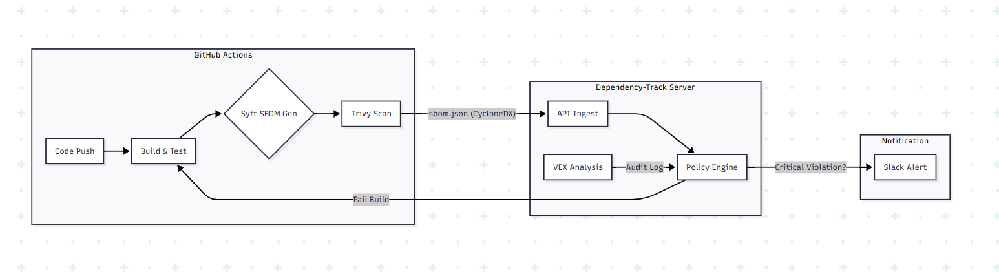

# 프로젝트 기획 : 금융권 공급망 보안 자동화 시스템

## 1. 프로젝트명 
### 1-1. 기획 배경
* **규제 대응 필수화**
    * **전자금융감독규정 제17조(정보처리시스템 등의 보호대책)**: 오픈소스 등 외부 소프트웨어 도입 시 보안성 검토 의무화
    * 금융보안원 "오픈소스 SW 보안관리 안내서": SBOM 활용 및 생명주기(Life-cycle) 관리 권고
* **현장 문제 해결**
    *  단순 스캔 도구의 높은 오탐(False Positive) 피로도 개선
    *  개발 생산성을 저해하지 않는 CI/CD 단계의 자동 차단 시스템 필요
    *  수천 개의 라이브러리 수동 관리(Excel)의 한계 극복
  
### 1.2 핵심 목표

**Zero-Trust Supply Chain** : 신뢰할 수 없는 외부 라이브러리의 무분별한 반입을 CI/CD 단계에서 원천 차단
**VEX 프로세스 구현** : 취약점이 발견되었으나 실제로는 영향받지 않는 경우(Not Affected), 예외 처리를 시스템화하여 불필요한 대응 비용 절감
**Audit-Ready Reporting** : 감독기관 감사 시 즉시 제출 가능한 수준의 자산 현황 보고서 자동 생성

## 2. 시스템 아키텍처

> GitHub Actions와 Dependency-Track을 연동하여 파이프라인 내에서 보안 검증을 수행합니다.

## 3. 기술 스택 (Tech Stack)

| 구분 | 기술 (Stack) | 역할 및 선정 이유 |
| :--- | :--- | :--- |
| **Core** |  | 중앙 관리 서버, 리스크 점수 산정 및 VEX 관리 |
| **Pipeline** |  | CI/CD 파이프라인 자동화, 보안 스캔 트리거 |
| **SBOM** |  | 컨테이너/파일시스템 스캔 및 CycloneDX 포맷 생성 |
| **Scanner** |  | CVE 데이터베이스 대조, 초동 취약점 식별 |
| **Standard** |  | 오탐 처리(Not Affected) 및 감사 증적 표준 문서 포맷 |
| **Alert** |  | 임계치(Critical) 초과 시 보안팀 실시간 알림 전송 |

## 4. 공격 시나리오 시뮬레이션

**상황** : 악의적 내부자의 공급망 오염 시도
**사례 기반** : xz-utils 백도어 (CVE-2024-3094) - 2024년 리눅스 배포판 전체를 위협한 공급망 공격

### 4.1 시나리오 흐름
공격자가 악성 코드가 심어진 패키지를 몰래 추가했을 때, 시스템이 이를 어떻게 차단하는지 시연함.

1. **Attack (침투 시도)** 
    * 개발자(공격자)가 백도어가 포함된 악성 라이브러리를 'requirements.txt'에 추가하고 Github에 Push하려고 함.
2. **Detection (탐지)** 
    * Github Actions 파이프라인이 트리거됩니다.
    * **Syft**가 SBOM을 추출하고, **Trivy**가 DB와 대조하여 **Malicious Package**를 식별.
3. **Blocking (차단)**
    * Dependency-Track 정책 엔진이 이를 감지하고 **Critical Policy Violation**판정을 내림.
    * CI/CD 파이프라인이 즉시 중단(**Build Failed**)되며 코드가 통합되지 않도록 막음.
4. **Reporting (알림)**
    * Slack으로 즉시 경고 알림이 전송됨.
    * '[Critical] 공급망 공격 의심 행위 차단됨 (User: dev_attacker, Package: liblzma)'

## 5. VEX (Vulnerability Exploitability Exchange) 구현전략

단순한 취약점 스캔은 수많은 오탐(False Positive)를 발생시켜 개발팀을 지치게 함.
본 프로젝트는 **Dependency-Track의 Audit 기능**을 활용해 실질적 위험만 관리함.

* **오탐 피로도 감소 (Noise Reduction)**
    * 취약점이 탐지되었으나, 내부 로직상 해당 함수를 호출하지 않는 경우 **Not Affected**상태로 판정.
* **감사 증적 자동화 (Audit Ready)**
    * 분석 결과를 **CycloneDX VEX**문서로 Export하여 금융당국 감사 시 소명 자료로 즉시 활용 가능함.
* **스마트 거버넌스 (Smart Governance)**
    * 무조건적인 차단이 아니라, VEX 분석을 거친 후 **실제 악용 가능한** 위협만 선별적으로 차단.
  

## 6.  산출물 (Deliverables)

| 구분 | 산출물 | 설명 |
| :--- | :--- | :--- |
| **Dashboard** | **관리자 대시보드** | Dependency-Track을 통해 전사 라이브러리 현황과 위협 점수를 시각화한 화면 |
| **Demo** | **차단 시연 영상** | 취약한 라이브러리 배포 시도 시 CI/CD가 중단되고 Slack 알림이 오는 전체 과정 녹화 |
| **Docs** | **VEX Export 샘플** | "Not Affected" 판정이 포함된 CycloneDX 포맷의 감사 증적용 JSON 문서 |
| **Policy** | **보안 가이드라인** | 사내 오픈소스 도입 절차 및 보안 규정을 정리한 정책 문서 (PDF) |