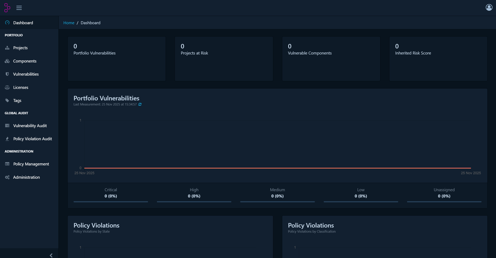

# [Day 1] SBOM 프로젝트 인프라 구축: Dependency-Track & Ngrok

> **작성일**: 2025.11.25
> **주제**: 오픈소스 관리를 위한 Dependency-Track 서버 구축과 외부 접속 허용
> **태그**: #Security #SBOM #Docker #DependencyTrack #Ngrok

## 1. 오늘의 목표 
- [o] Docker를 활용해 로컬 환경에 Dependency-Track 서버 구축
- [o] 관리자 대시보드 접속 및 초기 설정
- [o] Ngrok을 이용해 외부(GitHub)에서 내 노트북으로 접속할 수 있도록 터널링

---

## 2. 배운점 (Key Takeaways) 

### 2.1 Dependency-Track이란?
단순히 취약점을 한 번 스캔하고 끝나는 도구(Trivy)와 달리, **조직의 모든 소프트웨어 자산을 지속적으로 모니터링하는 플랫폼**이다.
- **CCTV**에 비유할 수 있다. 어제는 안전했던 라이브러리가 오늘 취약해지면 즉시 알람을 준다.
- **Trivy**는 들어오는 문을 지키는 문지기(CI/CD)고, **Dependency-Track**은 내부 자산을 관리하는 관제탑이다.

### 2.2 왜 Docker를 사용했는가?
Dependency-Track은 Java 기반의 복잡한 웹 애플리케이션이다. 이를 내 노트북에 직접 설치하려면 JDK 버전 맞추기, 환경 변수 설정 등 복잡한 과정이 필요하다.
Docker 이미지를 사용하면 **"제작자가 세팅해둔 환경 그대로"** 컨테이너만 띄우면 되므로 구축 시간을 획기적으로 단축할 수 있었다.

---

#  핵심 용어 및 개념 정리 (Key Concepts)

본 프로젝트(공급망 보안 파이프라인)를 이해하기 위해 필수적인 핵심 기술 용어들을 정리한다.

## 1. CI/CD (지속적 통합 및 배포)

개발자가 코드를 작성하고 사용자에게 전달되기까지의 과정을 **자동화**하는 방법론.

### 🔹 CI (Continuous Integration, 지속적 통합)
* **개념**: 여러 개발자가 작성한 코드를 **자주(하루에 수십 번) 합치고, 자동으로 빌드 및 테스트**하는 과정.
* **비유**: 작가들이 원고를 쓸 때마다 맞춤법 검사기가 자동으로 돌아가서 오타를 잡아주는 것.
* **이 프로젝트에서의 역할**:
    * GitHub Actions가 코드가 푸시될 때마다 자동으로 실행되어 SBOM을 생성하는 단계.

### 🔹 CD (Continuous Delivery/Deployment, 지속적 제공/배포)
* **개념**: CI를 통과한 소프트웨어를 **실제 사용자 환경(Production)에 자동으로 배포**하는 과정.
* **비유**: 교정이 끝난 원고를 인쇄소로 보내고, 서점에 진열까지 자동으로 해주는 것.
* **이 프로젝트에서의 역할**:
    * 보안 검사(Dependency-Track)를 통과한 안전한 코드만 실제 서버에 배포되도록 허용하는 단계.

---

## 2. 보안 도구 (Security Tools)

### 🔹 Trivy (보안 스캐너)
* **분류**: **Scanner** (CLI 도구)
* **특징**:
    * **Stateless (상태 없음)**: 과거 데이터를 기억하지 않고, 지금 이 순간의 파일만 검사함.
    * **속도**: 매우 빠름.
    * **범위**: 컨테이너 이미지, 파일 시스템, Git 리포지토리 등 올인원 스캔.
* **핵심 역할**: "공항 검색대"
    * CI 파이프라인(GitHub Actions) 중간에 배치하여, 보안 위협이 감지되면 즉시 배포를 차단(Block)하는 **문지기(Gatekeeper)** 역할.

### 🔹 OWASP Dependency-Track (SCA 플랫폼)
* **분류**: **Platform** (서버형 관리 도구)
* **특징**:
    * **Stateful (상태 유지)**: 자산 데이터를 DB에 저장하고 **지속적으로 추적**함.
    * **모니터링**: 어제는 안전했던 라이브러리가 오늘 취약점(Zero-day)이 발견되면 즉시 알람을 줌.
    * **입력값**: 소스코드가 아닌 **SBOM(명세서)**을 받아서 분석함.
* **핵심 역할**: "질병관리청 관제 센터"
    * 전사적인 소프트웨어 자산 현황을 시각화하고, 장기적인 보안 리스크를 관리하는 **중앙 관제탑(Control Tower)** 역할.

### 🔹 SBOM (Software Bill of Materials)
* **개념**: **소프트웨어 구성 명세서**.
* **비유**: 식품의 **'성분 표기표'** (원재료: 밀가루, 설탕, 우유...).
* **역할**: "우리 소프트웨어 안에 정확히 어떤 라이브러리의 몇 버전을 썼는지"를 기록한 문서. (표준 포맷: CycloneDX, SPDX)

## 3. 트러블 슈팅 (Trouble Shooting) 

###  문제 발생: Ngrok 인증 에러
Ngrok 실행 시 다음과 같은 에러가 발생하며 실행되지 않음.
```bash
ERROR:  authentication failed: Usage of ngrok requires a verified account and authtoken.
ERROR:  ERR_NGROK_4018
```

---

## 4. 초기 화면

