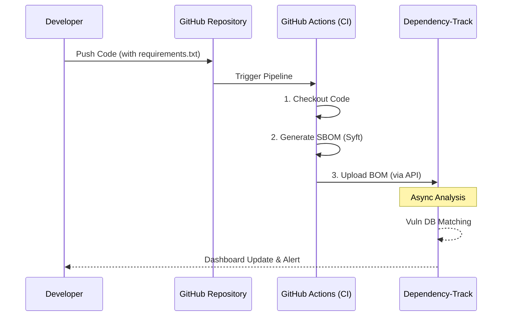
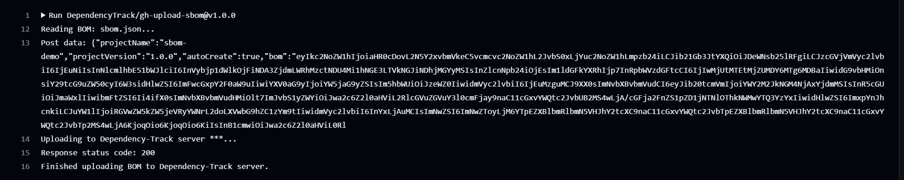
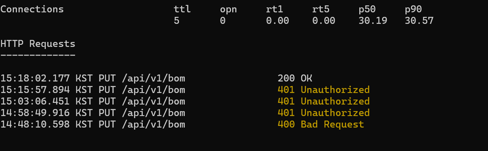
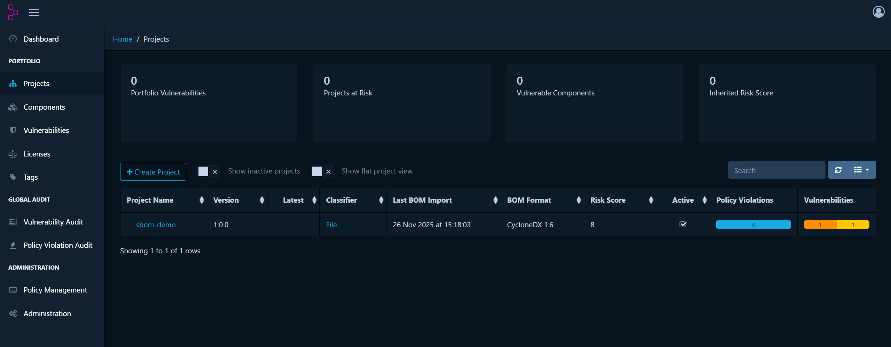

# [Day 2] CI/CD 기반 공급망 보안 자동화 파이프라인 구축

> **작성일**: 2025.11.26
> **주제**: GitHub Actions와 Dependency-Track을 연동한 SBOM 자동 분석 체계 구현
> **태그**: #DevSecOps #CI/CD #GitHubActions #SCA #Troubleshooting

## 1. 개요 (Overview)
Day 1에서 구축한 인프라(Dependency-Track)에 **"자동화된 혈관"**을 연결하는 과정이다.
개발자가 소스코드를 푸시(Push)하는 즉시, 외부 개입 없이 자동으로 소프트웨어 명세서(SBOM)가 생성되고 보안 서버로 전송되어 취약점 분석이 수행되도록 구성한다.

### 1.1 전체 흐름도 (Architecture Workflow)



## 2. 구축 과정 상세 (Step-by-Step)

### 2.1 타겟 리포지토리 구성 (`sbom-demo`)
취약점 탐지 테스트를 위해 의도적으로 **구버전 라이브러리**를 포함한 환경을 구성함.
* **Target File**: `requirements.txt`
* **Injected Vulnerabilities**:
    * `Django==2.2.0` (SQL Injection 등 다수 취약점 존재)
    * `requests==2.19.0`
    * `log4mongo==1.0.0`

### 2.2 인증 체계 수립 (Authentication)
외부(GitHub)에서 내부(Dependency-Track)로 데이터를 전송하기 위해 **API Key** 방식의 인증을 사용함.
1.  **Dependency-Track**: `Automation` 팀 권한으로 API Key 발급.
2.  **GitHub Secrets**: 보안을 위해 Key와 URL을 환경변수로 암호화하여 저장.
    * `DTRACK_KEY`: (Masked)
    * `DTRACK_URL`: Ngrok 터널링 주소 (프로토콜 제외)

### 2.3 파이프라인 코드 구현 (`sbom-pipeline.yml`)
GitHub Actions 워크플로우를 통해 **SCA(Software Composition Analysis)** 프로세스를 코드로 구현(IaC).

```yaml
name: Supply Chain Security Pipeline

on:
  push:
    branches: [ "main" ]

jobs:
  sbom-process:
    runs-on: ubuntu-latest
    steps:
      # 1. 소스코드 내려받기
      - name: Checkout Code
        uses: actions/checkout@v3

      # 2. SBOM 생성 (Syft 도구 사용)
      - name: Generate SBOM
        uses: anchore/sbom-action@v0
        with:
          path: .
          format: cyclonedx-json
          output-file: sbom.json

      # 3. Dependency-Track으로 전송 (취약점 분석 요청)
      - name: Upload to Dependency-Track
        uses: DependencyTrack/gh-upload-sbom@v1.0.0
        with:
          serverHostname: ${{ secrets.DTRACK_URL }}
          apiKey: ${{ secrets.DTRACK_KEY }}
          autoCreate: true       # 프로젝트 자동 생성 활성화
          bomFilename: sbom.json
          projectName: sbom-demo # 필수: 프로젝트 식별자
          projectVersion: 1.0.0  # 필수: 버전 정보
```

### 2.4 핵심 기술 요소 분석 (Tech Stack Deep Dive) 
본 프로젝트에서 사용된 주요 보안 도구들의 역할과 선정 이유는 다음과 같다.

| 구분 | Syft | Trivy | Dependency-Track |
| :--- | :--- | :--- | :--- |
| **주목적** | **SBOM 생성** (목록 만들기) | **취약점 스캔** (문제 찾기) | **자산 관리 & 모니터링** |
| **비유** | 영수증 발급기 | 공항 보안 검색대 | 질병관리청 관제 센터 |
| **결과물** | `sbom.json` 파일 | 취약점 리스트 (Text) | 시각화 대시보드 (Web) |

* **Dependency-Track**: 일회성 스캔이 아닌, 자산을 저장하고 지속적으로 새로운 위협(Zero-day)을 모니터링하기 위해 도입.
* **Trivy**: 본 실습에선 사용하지 않았으나, CI 단계에서 즉시 차단(Blocking)하는 용도로 추후 도입 가능 (상호보완).

---

## 3. 트러블 슈팅 (Trouble Shooting) 

###  Issue 1: `getaddrinfo ENOTFOUND` (400 Error)
* **현상**: 업로드 단계에서 호스트를 찾을 수 없다는 에러 발생.
* **원인**: GitHub Secrets `DTRACK_URL`에 `https://` 프로토콜을 포함하여 입력함. (플러그인이 자동으로 붙여서 중복됨)
* **해결**: Secrets 값을 수정하여 `https://` 제거. (예: `xxx.ngrok-free.dev`)

###  Issue 2: `Bad Request` (400 Error)
* **현상**: 서버 연결은 되었으나 데이터 형식 오류 발생.
* **원인**: `gh-upload-sbom` 플러그인에 필수 값인 `projectName`과 `projectVersion`이 누락됨. 또한 지원하지 않는 `projectTypes` 옵션 사용.
* **해결**: YAML 파일 수정 (필수 값 추가 및 오타 옵션 제거).

###  Issue 3: `Unauthorized` (401 Error) - Critical
* **현상**: API Key는 정상이나 권한 없음 에러 지속 발생.
* **원인**: Dependency-Track의 `Automation` 팀 권한 설정 미흡.
    1.  단순 업로드 권한(`BOM_UPLOAD`)만 있고, **새 프로젝트 생성 권한(`PROJECT_CREATION_UPLOAD`)**이 없었음.
    2.  `autoCreate: true` 옵션이 작동하려면 생성 권한이 필수임.
* **해결**: 관리자 페이지 → Access Management → Teams → Automation 팀에서 `PROJECT_CREATION_UPLOAD` 체크 후 **Update**.

---

## 4. 엔터프라이즈 및 금융권 확장 시나리오 (Enterprise Scenarios) 

본 프로젝트는 MVP(Minimum Viable Product) 모델이나, 실제 **금융권/대기업 환경** 확장 시 아래와 같이 설계된다.

### 4.1 가상 시나리오: FinCorp (핀테크 기업)
* **환경**: MSA 기반 500개 이상의 마이크로 서비스 운영.
* **문제점**: 수동 관리로 인한 'Shadow IT' 리스크 및 컴플라이언스 대응 지연.

### 4.2 아키텍처 확장 (Scale-Up)

| 구분 | 현재 프로젝트 (MVP) | 엔터프라이즈 환경 (Real World) |
| :--- | :--- | :--- |
| **CI/CD** | **GitHub Actions** (SaaS) | **GitLab CI / Jenkins** (On-Premise + 망분리) |
| **Server** | **Docker Compose** | **Kubernetes (EKS)** + DB 이중화 |
| **Identity** | **API Key** | **OIDC / LDAP** (임직원 계정 연동) |
| **Network** | **Ngrok** | **VPN / Reverse Proxy** (폐쇄망 운영) |

### 4.3 규제 대응 포인트
1.  **전자금융감독규정 제17조**: 배포 전 보안성 검토 자동화(Blocking)로 규제 준수.
2.  **오픈소스 보안 가이드**: SBOM을 통한 전사 자산 식별 및 Audit 이력 관리.

---

## 5. 최종 결과 (Result) 

### 5.1 파이프라인 성공 로그
GitHub Actions에서 `200 OK` 응답 확인. (모든 트러블 슈팅 완료)




### 5.2 Dependency-Track 대시보드
자동으로 생성된 `sbom-demo` 프로젝트와 식별된 Critical 취약점 현황.



---
**[결론]**: 코드를 푸시하기만 하면, 자동으로 보안 취약점을 분석해주는 **SCA 자동화 시스템** 구축 완료.